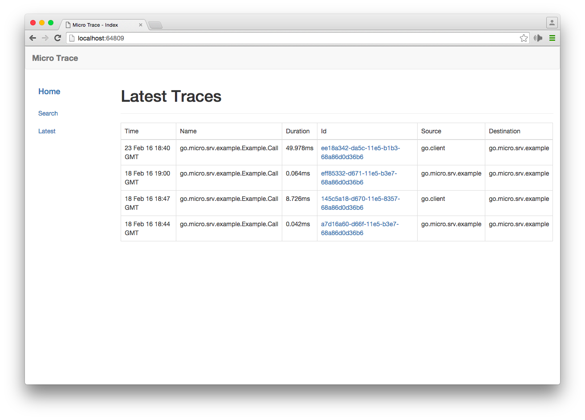
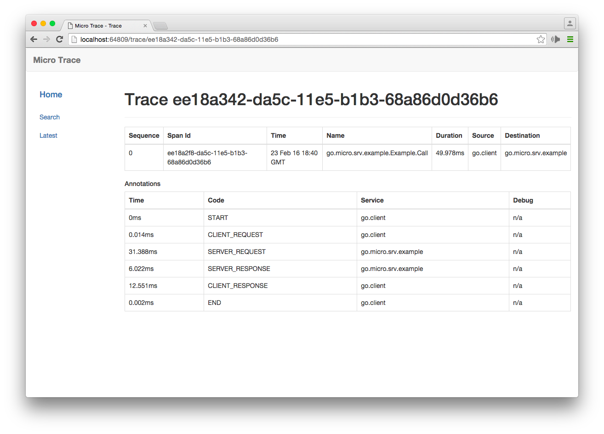
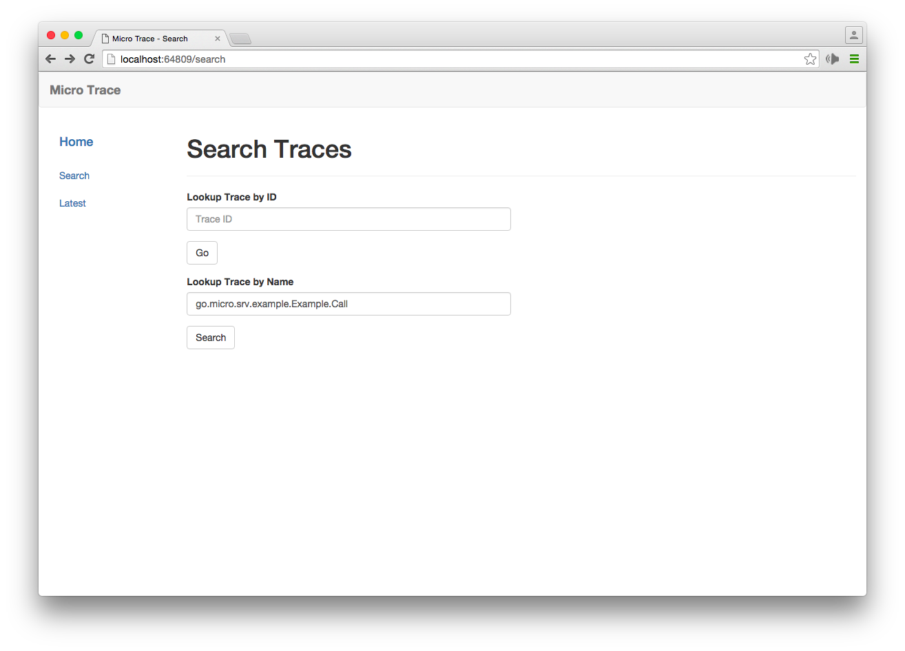

# Trace Web

The trace web is a dashboard for the trace service. 

## Dependence on Service
- [trace-srv](https://github.com/microhq/trace-srv)

## Getting started

1. Install Consul

	Consul is the default registry/trace for go-micro apps. It's however pluggable.
	[https://www.consul.io/intro/getting-started/install.html](https://www.consul.io/intro/getting-started/install.html)

2. Run Consul
	```
	$ consul agent -dev -advertise=127.0.0.1
	```

3. Download and start the service

	```shell
	go get github.com/micro/trace-web
	trace-web
	```

	OR as a docker container

	```shell
	docker run microhq/trace-web --registry_address=YOUR_REGISTRY_ADDRESS
	```


-

-


